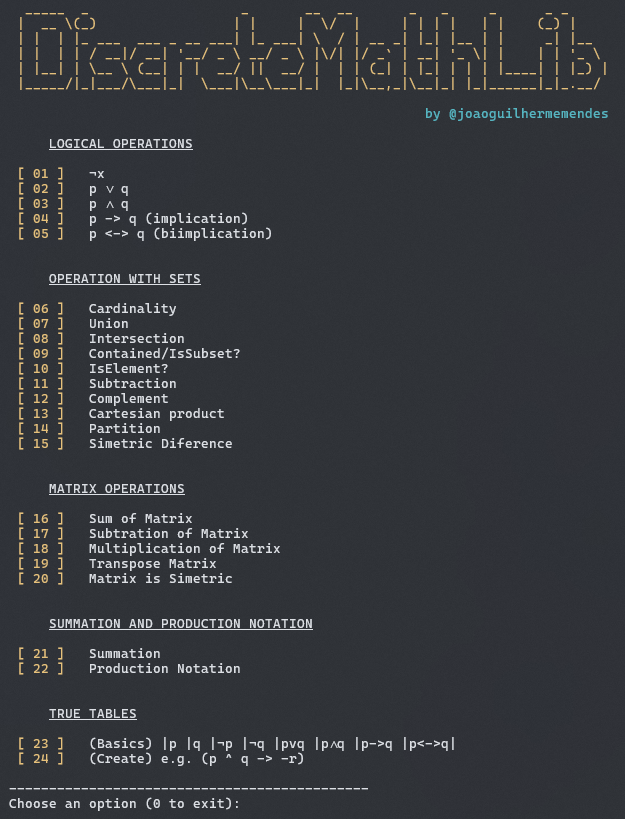
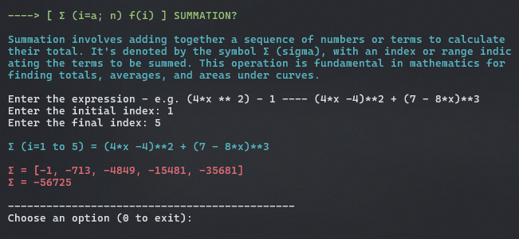
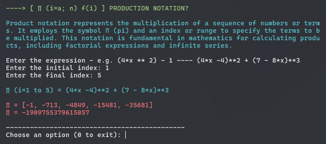
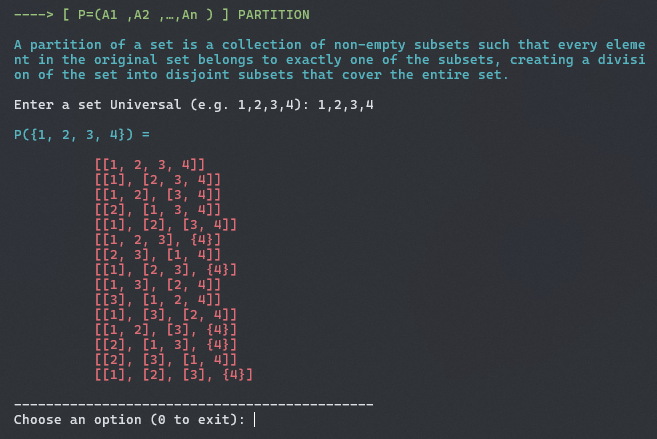
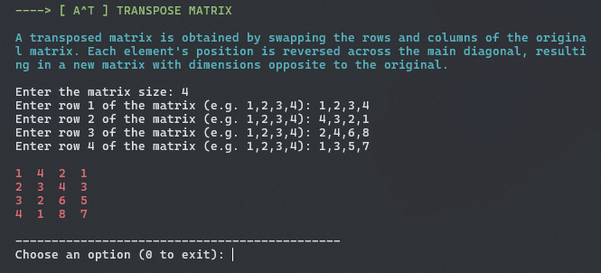

# Discrete Math Functions Collection
This repository contains a collection of Python functions designed to perform various operations commonly encountered in discrete mathematics courses. Whether you're studying sets, relations, functions, combinatorics, or graph theory, this collection aims to provide helpful tools to assist you in your studies.

 

## Functions Included:

 

## Samples Demonstration

 

## To Do:
 - [x] Code the (Basic) TRUE TABLE function
 - [ ] Create a generalized function for the user creates a logic expression (e.g. https://web.stanford.edu/class/cs103/tools/truth-table-tool/)
 - [x] Re-Order index (Remove 01 | Maybe 07, 08 (need to think about))
 - [x] Create a Label for the prints (e.g. [ UNION ]) / some different color
 - [x] Step-by-Step Demonstrations
 - [x] Quick description in call functions
 - [x] Improve Summation equation possibilities
